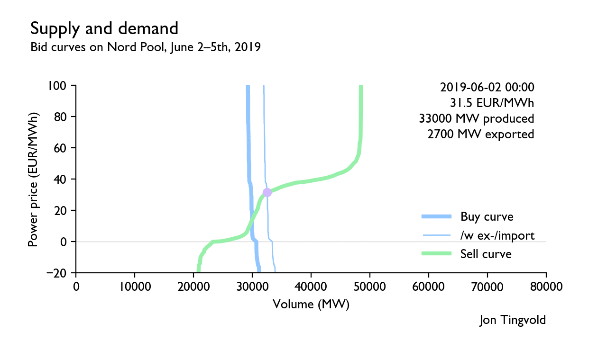

# Supply and demand curves on Nord Pool

This is a data visualization project by Jon Tingvold in July 2019 to visualize the bid curves on Nord Pool, a power exchange for the Nordic (Norway, Danmark, Sweden, Finland, Estonia, Latvia, and Lithuania) day-ahead electricity market where 90% of the power in the Nordic is traded.

#### Bid curves for individual price areas are not publicly available

Nord Pool makes only available data on bid curves for the whole region together—not individual price areas like NO5 (West-Norway) and DK1 (Jylland). The price shown is the «system price,» the price if there had been no congestion between price areas. Prices in Norway are usually close to this price. None of the power contracts on Nord Pool is settled with the system price. However, it is used as a reference price for derivative contracts on Nasdaq OMX. 

#### Block bids

Block bids (bids for multiple hours, for instance: «six hours for an average price of 33 EUR/MWh»), is included by shifting the supply/sell or demand/buy curve, in other words, set as bids with the minimum and maximum price. Most of the day-night shift in the supply curve is caused by block bids. Buy-block bids are around 2000–4000 MW, and sell-block bids are around 500 MW.

#### Import/export

Export/import is handled by shifting the demand/buy curve. Both the buy curve before and after import/export shift is plotted.

Results
---------------

### A normal week in March

### A week with high prices in December

### A week with low prices in June

### Full history 2014–2019 on YouTube

Explanation of the bid curves
-----------

#### Case: A normal low demand hour (June 7th, 2019, 0–1am)

*Buy and sell curves on Nord Pool. Sell-block bids are 2332 MW and buy-block-bids 787 MW.*

Here comes a brief explanation of the bid curve and the bids of different power producers.

Demand (thick blue line) is ca. 29,000 MW and the curve is almost totally inelastic except for a small increases by ca. 1000 MW if prices move below 0 EUR/MWh. If we add net exports (demand from other markets), demand (thin blue line) moves to ca. 33,000 MW.

Since demand is 33,000 MW, the supply (green line) must also be 33,000 MW at equilibrium. According to the figure, 22–25,000 MW of power producers offer power to negative prices. Of this, ca. 2332 MW is block bids (bids which depend on the average price over multiple hours) that do not really bid negative prices, but are just visualized this way. Ca. 6–8000 MW of production bid zero prices. Ca. 5000 MW of accepted sell bids bid 0–30 EUR/MWh, and ca. 15–20,000 MW available unused capacity bid ca. 30–50 EUR/MWh.

Most of the marginal power in the Nordic power system is storable hydropower. Storable hydropower should bid the expected marginal opportunity cost of the water (also called *water value*)—the lowest price you would get if you sold all the water in your reservoir at the most optimal prices until the reservoir ether was empty or full from new inflowing water. The water value is hard to estimate. It depends mostly on power prices in the future, which of course itself is heavily dependent on water values in the Nordic, creating a positive feedback loop.

Most of the unused power is hydropower, and we can see that most of them bid between 30–50 EUR/MWh. However, because of snowmelt and rain the day before, the water value (and thus the bids) for many hydropower plants are probably low or zero. In addition, there is a good amount of non-storable river hydropower (ca. 4000 MW) which bid ca. 0 EUR/MWh.

The other large group of zero bidders is probably wind producers. Since wind turbines can be turned off at negative prices, all wind farm owners should, at least ideally, bid ca. 0 EUR/MWh. However, many wind power producers have sold much of the power through power purchase agreements (PPA), and I suspect some of these contracts does not specify that the wind producers should turn off their turbines at negative prices. Some wind producers might therefore submit negative bids.

There are several producers that must bid negative prices/the minimum price (-500 EUR/MWh) to be guaranteed production. The largest group is nuclear (ca. 10,000 MW), which is too slow to adjust production up or down according to consumption. The other group is steam engine power plants e.g. coal, that is time-consuming and expensive to start, and thus bid the minimum price for the proportion required to keep the power plant at minimum production. This also applies to some former coal-fired power plants in Finland that have been rebuilt to burn peat or wood.

Otherwise, some producers bid the minimum price prices out of convenience. Some producers are too small to bother micromanaging production. Some might plan production more than a day ahead according to estimated prices, and bid the minimum price to guarantee production in line with the plan. Many slow ramping coal plants and cascading river networks, which need a consistent hour-to-hour plan, often make a production plan ahead even though they often could have used block bids instead. Anyway, both alternatives show up as minimum bids in the graph.

Gas and coal power plants are mostly switched off at this time of year due to low power prices. The marginal cost of gas and coal in June 2019 is ca. 40 and 50 EUR/MWh, of which CO2 permits account for ca. 8 and 20 EUR/MWh (see table). The places where gas/coal power plants are still running are mostly the Baltic countries where the price of electricity is higher than the system price (ca. EUR 45 MWh). In addition, some steam power stations (coal/peat/bio) are operating in Finland despite low prices (7 EUR/MWh at 00-01) to start production to cope with the power deficit later that morning with price spikes of ca. 150 EUR/MWh at 08–09 (see map further down).

##### Table: Generated power same time

<table>
<tr><th>Source</th><th>Generation&nbsp;(of capacity)[*]&nbsp;&nbsp;&nbsp;&nbsp;</th><th>Short term  marginal cost  (fuel+CO2 +operating=MC)</th><th>Shutdown /ramping speed</th><th>Probable bid</th></tr>
<tr><td>Nuclear</td><td>9&nbsp;839 MW (90%)</td><td>6+0+15≈20 EUR/MWh</td><td>Days</td><td>Almost all of bids -500&nbsp;EUR/MWh</td></tr>
<tr><td>Wind</td><td>4&nbsp;399&nbsp;MW (39%)</td><td>0&nbsp;EUR/MWh</td><td>Seconds</td><td>0—4&nbsp;EUR/MWh (or -500 depending on PPA?)</td></tr>
<tr><td>Rivers</td><td>3&nbsp;432&nbsp;MW (80%)</td><td>0&nbsp;EUR/MWh</td><td>Seconds</td><td>Most bids around 0&nbsp;EUR/MWh (or -500)</td></tr>
<tr><td>Stored hydro</td><td>14&nbsp;143&nbsp;MW (40%)</td><td>0–60 EUR/MWh(**)</td><td>Seconds</td><td>0–60&nbsp;EUR/MWh, many of the producing generators probably 0–20 EUR/MWh because of spring water</td></tr>
<tr><td>Gas</td><td>897&nbsp;MW (29%)</td><td>28+8+3≈40 EUR/MWh</td><td>Minutes</td><td>Most bids around 40&nbsp;EUR/MWh</td></tr>
<tr><td>Coal</td><td>208&nbsp;MW (7%)</td><td>25+20+5≈50&nbsp; EUR/MWh</td><td>Hours</td><td>—20-30% -500&nbsp;EUR/MWh —some block bids around 50 EUR/MWh —rest hour bids around 50 EUR/MWh</td></tr>
<tr><td>Other fossils</td><td>632&nbsp;MW (27%)</td><td>—</td><td>Hours</td><td>Same?</td></tr>
<tr><td>Bio and waste</td><td>1&nbsp;042&nbsp;MW (46%)</td><td>—</td><td>Hours</td><td>Most bids probably around -500&nbsp;EUR/MWh</td></tr>
<tr><td>Other</td><td>647&nbsp;MW (19%)</td><td>—</td><td>—</td><td>—</td></tr>
<tr><td><strong>Total</strong></td><td><strong>35&nbsp;239&nbsp;MW</strong></td><td>of 67&nbsp;000&nbsp;MW</td><td></td><td></td></tr>
</table>   

*(\*) According to ENTSOE, a European network of transmission system operators (TSOs; e.g. Statnett)*   
*(\*\*) Water value/marginal opportunity cost of water is hard to estimate since it depends on the predicted spot prices in the future.*

##### Map: Area prices same time (12pm–1am)

The area prices in Finland, Sweden and northern Norway are a bit lower (ca. 7 EUR/MWh) than the system price (ca. 22 EUR/MWh), Southern Norway and Danmark a bit higher (ca. 30 EUR/MWh), and the prices in baltic is a bit independent and dominated by the marginal cost of coal and gas.

##### Map: Area prices later that morning (8am–9am)

